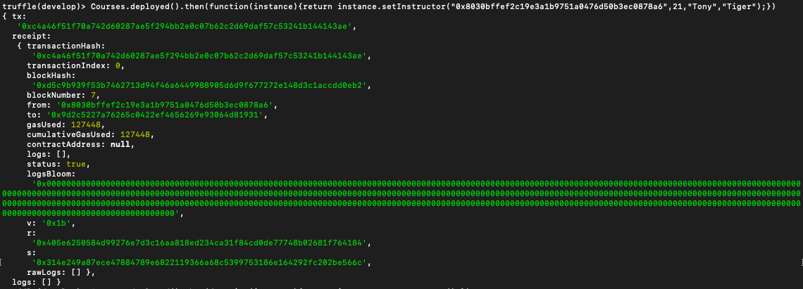
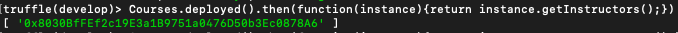
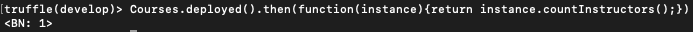

<h1>Solidity Mappings & Structs tutorial</h1>

Making the contract that's at the end of <a href="https://coursetro.com/posts/code/102/Solidity-Mappings-&-Structs-Tutorial">Solidity Mappings & Structs tutorial</a>. This contract should be compatible with solidity 0.5 or higher.

<h2>Process:</h2>
<ol>
<li>
 <h3>Installing solidity and truffle using npm.</h3>
 <pre>
<code>
 $ npm i -g solc
 $ npm i -g truffle
</code>
</pre>
</li>
<li>
<h3>Creating a project.</h3>
 
 Creating a project called<em> assignment4</em> and enter the project/folder. While inside the folder use the <em>truffle init</em> command to init a project, this will create the structure of the project.

<pre>
<code>
 $ mkdir assignment4
 $ cd assignment4
 $ truffle init
</code>
</pre>
</li>
<li>
<h3>Creating contract.</h3>

Creating a contract called <em>Courses</em> inside of the contract folder using truffle. After this command the contracts folder will have two files inside called <em>Courses.sol</em> and <em>Migrations.sol</em>.

<pre>
<code>
 $ truffle create contract Courses  
</code>
</pre>

When following the <a href="https://coursetro.com/posts/code/102/Solidity-Mappings-&-Structs-Tutorial">tutorial</a>, there are a few things we need to change within our own contract. We need to change the solidity version the contract uses. Since we are changing the version, we'll need to fix the syntax in a few lines to prevent error(s) when compiling.

 

Fixed contract with solidity version 0.5

<pre>
<code>
pragma solidity ^0.5.0;

contract Courses {
    struct Instructor {
        uint age;
        string fName;
        string lName;
    }
    mapping (address => Instructor) instructors;
    address[] public instructorAccts;
    constructor() public {
    }
    function setInstructor(address _address, uint _age, string memory _fName, string memory _lName) public {
        //var instructor = instructors[_address];
        instructors[_address].age = _age;
        instructors[_address].fName = _fName;
        instructors[_address].lName = _lName;
        instructorAccts.push(_address) -1;
    }
    function getInstructors() view public returns(address[] memory) {
        return instructorAccts;
    }
    function getInstructor(address _address) view public returns (uint, string memory, string memory) {
        return (instructors[_address].age, instructors[_address].fName, instructors[_address].lName);
    }
    function countInstructors() view public returns (uint) {
        return instructorAccts.length;
    }
}
</code>
</pre>
</li>
<li>
 <h3>Creating file in migration.</h3>
 
Inside the migration folder create a javascript file named <em>2_mig</em>. This file is used by truffle so truffle knows what to compile. The file should contain the following code:

 <pre>
 <code>
 var ton = artifacts.require("Courses"); 
 module.exports = function(deployer) { 
	 deployer.deploy(ton); 
};
 </code>
 </pre>
</li>
<li>
 <h3>Testing the contract.</h3> 
 
To test the contract you will need to complete the following code. <em>Truffle develop</em> allows a user to test and debug the functions within the contract.

<pre>
<code>
 $ truffle compile
 $ truffle migrate --reset
 $ truffle develop
</code>
</pre>
 
Once inside the truffle develop environment we need to compile the contract.

 <pre>
 <code>
  > migrate --reset --all
 </code>
 </pre>
 
Testing setInstructor function:

 <pre>
 <code>
  > Courses.deployed().then(function(instance){return instance.setInstructor("0x8030bffef2c19e3a1b9751a0476d50b3ec0878a6",21,"Tony","Tiger");})
</code>
</pre>

Output:

 
Testing getInstructor function:

 <pre>
 <code>
  > Courses.deployed().then(function(instance){return instance.getInstructor("0x8030bffef2c19e3a1b9751a0476d50b3ec0878a6");})
</code>
</pre>

Output:

 
Testing getInstructors function:

 <pre>
 <code>
  > Courses.deployed().then(function(instance){return instance.getInstructors();})
</code>
</pre>

Output:

 
Testing countInstructors function:

 <pre>
 <code>
  > Courses.deployed().then(function(instance){return instance.countInstructors();})
</code>
</pre>

Output:

</li>
</ol>
<h6>Anthony Davis</h6>
